# EASE

**E**ffortless **A**udio-**S**ynesthesia **E**xperience

Real-time audio visualizer with AI-powered image generation. Drop in audio, see it come alive.

<p align="center">
  
  <br>
  <em>Real-time audio visualization with AI-generated imagery</em>
  <br>
  <a href="https://youtu.be/-Z8FJmfsGCA">▶️ Watch with sound</a>
</p>

## I'm a Human

This is an experimental project, for fun and learning. I've always been interested in reactive visualizations and have dabbled for many years.

My hope is that EASE makes playing around with these ideas more accessible. It's an open book to hack apart, or just run it and enjoy some crazy visuals. Exploration is fun - this is the result!

Yes, I used a hyphen, though you'll see some em-action below because I let Claude write the rest of this document, with my guidance, cause why not? In fact, this entire project is co-written between me and Claude ... a great force multiplier!

Hope you enjoy.

## Why EASE?

**See sound. Feel music.**

EASE turns any audio into a living visual experience. Whether you're a VJ performing live, a content creator making music videos, or just vibing to your favorite tracks—EASE responds to every beat, every note, every silence.

- **Instant setup** — Drop audio, get visuals. No configuration required.
- **AI that listens** — Generated imagery that actually dances to your music.
- **Real-time** — Actual 20 FPS generation, not pre-rendered frames or slideshows.

## Features

- **AI-Powered Visualization**: Real-time AI-generated imagery that responds to your music
- **Real-time AI Generation**: AudioReactive (~10-15 FPS, default), StreamDiffusion (~15-20 FPS), or FLUX.2 Klein (~1-3 FPS, higher quality)
- **2 Generation Modes**: Live Feedback (real-time), Pose Animation (ControlNet + RIFE)
- **5 Audio Mapping Presets**: Reactive, Dancer, VJ Intense, Dreamscape, Color Organ
- **Beat Detection**: Multi-band spectral flux analysis with tempo tracking
- **Optional Lyric Detection**: Whisper-based transcription to modulate prompts

## Architecture

```mermaid
flowchart TB
    subgraph Frontend["Frontend (React + Three.js)"]
        AI[Audio Input<br/>File / Tab / Mic] --> AA[Audio Analyzer<br/>FFT, Beat, Onset]
        AA --> AM[Audio Metrics]
        AM --> VE[Visualizer Engine<br/>AI Mode]
        VE --> Canvas[Canvas Output]
    end

    subgraph Backend["Backend (FastAPI + PyTorch)"]
        WS[WebSocket Handler] --> MP[Audio Mapper<br/>5 Presets]
        MP --> GP[Generation Pipeline<br/>StreamDiffusion]
        GP --> FE[Frame Encoder]

        subgraph Optional["Optional Features"]
            CN[ControlNet<br/>Pose Control]
            LD[Lyric Detection<br/>Whisper + Demucs]
            ST[Story System<br/>Narrative Sequences]
        end
    end

    AM -->|metrics| WS
    FE -->|frames| VE

    style Frontend fill:#1a1a2e
    style Backend fill:#16213e
    style Optional fill:#0f3460
```



## Components

### Core

| Component               | Description                                                                                          | Details                                                      |
| ----------------------- | ---------------------------------------------------------------------------------------------------- | ------------------------------------------------------------ |
| **Audio Analyzer**      | FFT analysis, beat detection, onset detection, chroma features                                       | [frontend/src/audio/](frontend/src/audio/)                   |
| **Visualizer Engine**   | Three.js renderer with AI-powered visualization                                                      | [frontend/src/visualizer/](frontend/src/visualizer/)         |
| **AI Generator**        | WebSocket connection to backend, real-time frame streaming                                           | [useAIGenerator.ts](frontend/src/ui/hooks/useAIGenerator.ts) |
| **Generation Pipeline** | Orchestrates txt2img/img2img with StreamDiffusion optimization                                       | [server/src/generation/](server/src/generation/)             |
| **Audio Mapper**        | Maps audio metrics to generation parameters via presets                                              | [server/src/mapping/](server/src/mapping/)                   |

### Story System

| Component            | Description                                                        | Details                                                              |
| -------------------- | ------------------------------------------------------------------ | -------------------------------------------------------------------- |
| **Story Controller** | Narrative sequence playback with audio-triggered scene transitions | [useStoryController.ts](frontend/src/ui/hooks/useStoryController.ts) |
| **Story Backend**    | Scene definitions, triggers, and transitions                       | [server/src/story/](server/src/story/)                               |

### Experimental

| Component           | Description                                     | Details                                  |
| ------------------- | ----------------------------------------------- | ---------------------------------------- |
| **Lyric Detection** | Whisper transcription + Demucs vocal separation | [server/src/lyrics/](server/src/lyrics/) |

## External Resources

EASE automatically downloads AI models from the internet on first use. Below is a summary of all external resources.

### Models Downloaded on First Run

| Model                                                                                           | Source       | Approx Size | Purpose                                 |
| ----------------------------------------------------------------------------------------------- | ------------ | ----------- | --------------------------------------- |
| [Lykon/dreamshaper-8](https://huggingface.co/Lykon/dreamshaper-8)                               | Hugging Face | ~2GB        | Base image generation (StreamDiffusion) |
| [latent-consistency/lcm-lora-sdv1-5](https://huggingface.co/latent-consistency/lcm-lora-sdv1-5) | Hugging Face | ~134MB      | LCM acceleration                        |

**FLUX.2 Klein Backend** (`generator_backend: flux_klein`)

| Model                                                                                         | Source       | Approx Size | Purpose                       |
| --------------------------------------------------------------------------------------------- | ------------ | ----------- | ----------------------------- |
| [black-forest-labs/FLUX.2-klein-4B](https://huggingface.co/black-forest-labs/FLUX.2-klein-4B) | Hugging Face | ~12GB       | High-quality image generation |

### Optional Models (Downloaded When Features Enabled)

**ControlNet** (`use_controlnet: true`)

| Model                                                                                                 | Source       | Approx Size | Purpose       |
| ----------------------------------------------------------------------------------------------------- | ------------ | ----------- | ------------- |
| [lllyasviel/control_v11p_sd15_openpose](https://huggingface.co/lllyasviel/control_v11p_sd15_openpose) | Hugging Face | ~1.4GB      | Pose control  |
| [lllyasviel/ControlNet](https://huggingface.co/lllyasviel/ControlNet)                                 | Hugging Face | ~200MB      | Pose detector |

**Hyper-SD Acceleration** (`acceleration: hyper-sd`)

| Model                                                           | Source       | Approx Size   | Purpose              |
| --------------------------------------------------------------- | ------------ | ------------- | -------------------- |
| [ByteDance/Hyper-SD](https://huggingface.co/ByteDance/Hyper-SD) | Hugging Face | ~50MB/variant | Ultra-fast inference |

**NSFW Filter** (`nsfw_filter: true`)

| Model                                                                                                     | Source       | Approx Size | Purpose                   |
| --------------------------------------------------------------------------------------------------------- | ------------ | ----------- | ------------------------- |
| [CompVis/stable-diffusion-safety-checker](https://huggingface.co/CompVis/stable-diffusion-safety-checker) | Hugging Face | ~1.2GB      | Content filtering         |
| [openai/clip-vit-base-patch32](https://huggingface.co/openai/clip-vit-base-patch32)                       | Hugging Face | ~350MB      | Safety feature extraction |

**Lyric Detection** (`lyrics: true`)

| Model                                                            | Source                      | Approx Size | Purpose            |
| ---------------------------------------------------------------- | --------------------------- | ----------- | ------------------ |
| [faster-whisper](https://github.com/guillaumekln/faster-whisper) | OpenAI (via faster-whisper) | 39MB-2.9GB  | Speech recognition |
| [Demucs htdemucs](https://github.com/facebookresearch/demucs)    | Meta AI                     | ~83MB       | Vocal separation   |

### Cache Location

Models are cached in `~/.cache/huggingface/hub/` (default location) or wherever your HF home is. To clear the cache, delete this directory. When using Docker, models are stored in a named volume.

## Quick Start

```bash
git clone https://github.com/kevinraymond/ease && cd ease && docker compose up
```

Then open http://localhost:5173. That's it.

### Requirements

- **NVIDIA GPU** with 6GB+ VRAM (RTX 3060/4060 or better)
- **Docker** with [NVIDIA Container Toolkit](https://docs.nvidia.com/datacenter/cloud-native/container-toolkit/install-guide.html) (recommended), or:
- **Node.js** 18+, **Python** 3.10+, **CUDA** 11.8+

### Install

```bash
git clone https://github.com/kevinraymond/ease
cd ease
./scripts/setup.sh
```

### Run

```bash
# Terminal 1: Backend
cd server && uv run python -m src.main

# Terminal 2: Frontend
cd frontend && npm run dev
```

Open http://localhost:5173 in your browser.

### Docker

```bash
docker compose up
```

Open http://localhost:5173 in your browser.

> **Note:** On first run, the server downloads AI models (~2GB for core features). This may take several minutes depending on your connection. See [External Resources](#external-resources) for the complete list of models. Models are cached, so subsequent starts are fast.

### Usage

1. **Add Audio**: Drag and drop an audio file, or click "Capture Tab" to visualize browser audio
2. **Enable AI**: Click "AI Generator" panel, connect to server, and start generation
4. **Pick a Preset**: Choose how audio maps to visuals:
   - **Reactive** - Balanced audio response (default)
   - **Dancer** - Makes visuals dance to the beat
   - **VJ Intense** - High-energy strobing for live performance
   - **Dreamscape** - Smooth, ethereal drifting
   - **Color Organ** - Bass=red, mid=yellow, treble=blue

## Documentation

- [Quick Start Guide](docs/QUICKSTART.md) - Get running in 5 minutes
- [Architecture](docs/ARCHITECTURE.md) - System design and data flow
- [GPU Requirements](docs/GPU_REQUIREMENTS.md) - VRAM usage by feature
- [Troubleshooting](docs/TROUBLESHOOTING.md) - Common issues and solutions

## Configuration

The server reads configuration from environment variables with the `EASE_` prefix.
Copy `server/.env.example` to `server/.env` and adjust as needed.

### Minimal Config (~5.5GB VRAM)

```bash
EASE_MODEL=Lykon/dreamshaper-8
EASE_WIDTH=512
EASE_HEIGHT=512
EASE_USE_CONTROLNET=false
EASE_LYRICS=false
```

### Full Config (~12GB VRAM)

```bash
EASE_USE_CONTROLNET=true
EASE_LYRICS=true
```

### FLUX.2 Klein (~17GB VRAM, higher quality)

```bash
EASE_GENERATOR_BACKEND=flux_klein
EASE_FLUX_COMPILE=true        # 14x speedup (requires ~17GB VRAM)
EASE_FLUX_CACHE_PROMPT=true   # Cache prompt embeddings
EASE_FLUX_CPU_OFFLOAD=false   # Disable for compile mode
```

| Backend         | Quality   | Speed      | VRAM  |
| --------------- | --------- | ---------- | ----- |
| AudioReactive   | Good      | ~10-15 FPS | ~6GB  |
| StreamDiffusion | Good      | ~15-20 FPS | ~6GB  |
| FLUX.2 Klein    | Excellent | ~1-3 FPS   | ~17GB |

See [GPU Requirements](docs/GPU_REQUIREMENTS.md) for detailed VRAM breakdown.

## Generation Backends

EASE supports multiple image generation backends with different trade-offs between audio responsiveness, visual consistency, and performance.

### Backend Comparison

| Aspect | Audio Reactive | StreamDiffusion | FLUX.2 Klein |
|--------|----------------|-----------------|--------------|
| Design Focus | Audio responsiveness | Temporal consistency | Image quality |
| State | Stateless | Stateful (latent history) | Stateless |
| Speed | ~10-15 FPS | ~15-20 FPS | ~1-3 FPS |
| VRAM | ~5-6GB | ~6-7GB | ~12-17GB |
| Audio Response | Immediate | Smoothed | Per-frame |
| ControlNet | No | Optional | No |
| Best For | Beat-reactive visuals | Smooth animation | High-quality stills |

### When to Use Which

- **Audio Reactive** (default): Best for music visualization where beats should cause immediate visual changes. The seed acts as the primary audio response mechanism—changes in audio energy translate directly to visual variation. Ideal for abstract, beat-reactive visuals where you want the imagery to "dance" with the music.

- **StreamDiffusion**: Best for smooth, continuous animation with optional pose preservation via ControlNet. Maintains latent history for temporal coherence, so frames blend naturally into each other. Better for character animation, streaming content, or when visual stability is more important than beat accuracy.

- **FLUX.2 Klein**: Best when image quality matters more than frame rate. Uses the FLUX.2 4B parameter model for significantly higher quality output. Good for creating high-quality keyframes or when running on powerful hardware (24GB+ VRAM).

### How They Process Audio

**Audio Reactive:**
- Seed changes provide primary visual variation (different seeds = different images)
- `is_onset` triggers immediate visual boost on detected beats
- `is_beat_seed_jump` causes dramatic seed changes on strong beats
- No temporal smoothing—changes are immediate and direct
- Strength parameter controls how much the image deviates from the input

**StreamDiffusion:**
- Maintains a history of latent representations
- Temporal coherence via latent blending between frames
- Audio metrics modulate generation parameters (strength, guidance)
- Optional ControlNet preserves pose/structure across frames
- Smoother transitions but less immediate beat response

**FLUX.2 Klein:**
- Each frame generated independently at high quality
- Audio metrics map to prompt modulation and strength
- Supports latent caching during quiet sections for efficiency
- TeaCache accelerates similar consecutive frames

### Configuration

Set the backend via environment variable:

```bash
# Audio Reactive (default)
EASE_GENERATOR_BACKEND=audio_reactive

# StreamDiffusion
EASE_GENERATOR_BACKEND=stream_diffusion
EASE_USE_CONTROLNET=true          # Optional: enable pose preservation
EASE_CONTROLNET_POSE_WEIGHT=0.8   # ControlNet strength (0.0-1.0)

# FLUX.2 Klein
EASE_GENERATOR_BACKEND=flux_klein
EASE_FLUX_COMPILE=true            # Enable torch.compile for 1.5-3x speedup
EASE_FLUX_PRECISION=auto          # auto, bf16, fp8, or nvfp4
```

**Acceleration options** (Audio Reactive and StreamDiffusion):

```bash
EASE_ACCELERATION=lcm             # LCM-LoRA (default, stable)
EASE_ACCELERATION=hyper-sd        # Hyper-SD (faster, 1-2 steps)
EASE_HYPER_SD_STEPS=1             # Steps for Hyper-SD (1, 2, 4, or 8)
```

## Tech Stack

### Frontend

- React 18 + TypeScript
- Three.js for 3D visualization (WebGL2 default, experimental WebGPU support)
- Web Audio API for analysis
- Vite for development

### Server

- FastAPI + WebSocket
- PyTorch + Diffusers
- StreamDiffusion (fork) for real-time generation
- Optional: ControlNet, Whisper, Demucs

## Development

```bash
# Frontend development
cd frontend
npm run dev

# Server development (with auto-reload)
cd server
uv run uvicorn src.main:app --reload --port 8765

# Run tests
cd server && uv run pytest
cd frontend && npm test
```

## Technical Challenges

Interesting issues discovered during development.

### Minimum Strength Threshold for img2img

**Problem**: Intermittent VAE decode failures with error `cannot reshape tensor of 0 elements into shape [0, -1, 1, 512]`.

**Root cause**: With LCM/Hyper-SD acceleration using few inference steps (3-4), low `strength` values result in **zero denoising steps**:

```python
# diffusers img2img calculation
init_timestep = int(num_steps * strength)  # int(4 * 0.24) = 0
t_start = num_steps - init_timestep         # 4 - 0 = 4
timesteps = scheduler.timesteps[t_start:]   # Empty!
```

The pipeline passes empty latents to VAE decode, crashing the attention layer.

**Minimum strength formula**: `min_strength = 1.0 / num_inference_steps + epsilon`
- 4 steps: min ~0.26
- 3 steps: min ~0.34

**Why it surfaced**: The bug was latent but rarely triggered with React's state batching smoothing out audio metric timing. After migrating to vanilla TypeScript with more direct data flow, low-energy audio moments (silence, quiet passages) hit the pipeline more frequently.

**Fix**: Clamp strength dynamically based on inference steps:
```python
min_strength = 1.0 / self.num_inference_steps + 0.01
strength = max(min_strength, min(0.95, strength))
```

## License

MIT License - see [LICENSE](LICENSE) for details.

## Acknowledgments

- [StreamDiffusion](https://github.com/cumulo-autumn/StreamDiffusion) for real-time diffusion
- [FLUX.2](https://blackforestlabs.ai/) by Black Forest Labs for high-quality generation
- [Stable Diffusion](https://stability.ai/) for the base models
- [faster-whisper](https://github.com/guillaumekln/faster-whisper) for lyric detection
- [Demucs](https://github.com/facebookresearch/demucs) for vocal separation
